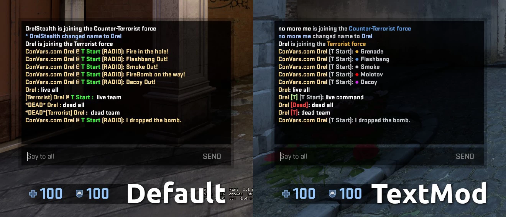
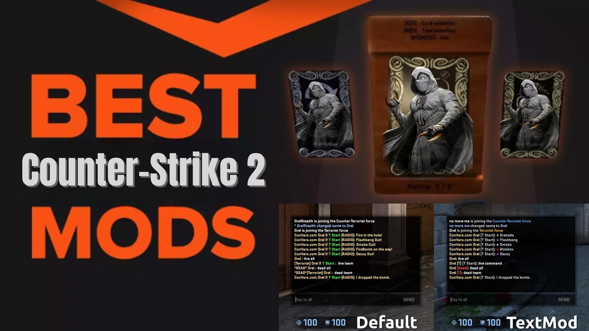

# Counter-Strike 2 Player Text Modification
Counter-Strike 2 Player Text Modification

## Install
 - Click this link to download the file (Press Ctrl+S)
 - Save this file as `csgo_textmod.txt` and put it inside this folder `Steam\SteamApps\Common\Counter-Strike Global Offensive\game\csgo\resource`
 - Open steam options add `-language textmod` to your launch options

## If not working?
 - **`csgo_textmod.txt`** is placed in the right folder, it needs to be inside the CS2 `game\csgo\resource` folder
 - Launch option is spelled correctly, this is an example that will work `-novid -language textmod`

